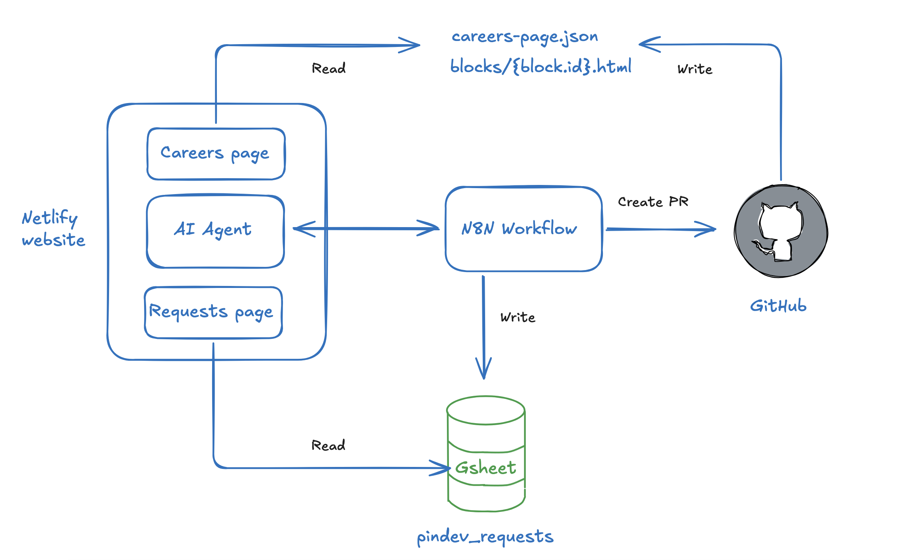

# Pindev

Pindev is an AI assistant that lets a careers-site customer request changes in plain language, and turns those requests into reviewed, shipped code. The customer never touches the code, and a developer never hand-edits files.

A customer describes what they want (add an About Us section, add a Meta pixel, fix a broken section). Pindev gathers the requirements through conversation, a specialist agent generates or edits the code, and the change is opened as a GitHub pull request for a human to review and merge. Automation does the work; a human stays on the decision.

The demo careers site belongs to a fictional hotel group, Halden. The page is defined as data (`careers-page.json`, a list of blocks), so a change is a structured edit to that file plus one HTML file per custom block.

- Workflow url (please share the emails I should grant access to): https://audaquiola.app.n8n.cloud/workflow/0JaHPiqTXqRBWJpN
- You can test the demo on the career builder page: https://halden-careers-page.netlify.app/builder

- Loom video (part 1): https://www.loom.com/share/89b1f3ab28014d7a8ff1b10fb2d536a3
- Loom video (part 2): https://www.loom.com/share/d77c3976528c4b958ee5f8944456b589

To review the full workflow, you will need access to the builder page's repository. Please share the emails I should grant access to.

In the agent chat, you can also enable the "Test workflow" mode, which will run the request on the webhook test url

---

## Setup

The system is one n8n workflow (`Pindev.json`) plus a Google Sheet and a GitHub repo.

1. **Import the workflow:** in n8n, *Workflows, Import from File, `Pindev.json`*.

2. **Add credentials** (create each in n8n and select it on the relevant nodes):
   - **Anthropic API** (used by the agents)
   - **GitHub API** (a token with Contents and Pull requests read/write on your repo)
   - **Google Sheets** (OAuth, for the status sheet)

---

## How it works

Two sources of truth, kept separate:

- **GitHub** holds the code: `careers-page.json` (the page as an ordered list of blocks) and one `blocks/{block.id}.html` per custom block. Changes go through a pull request.
- **A Google Sheet** (`pindev_requests`) is the runtime database: a row per request so the customer can track status.

The flow, end to end:

1. **Conversation.** A requirements agent gathers what's needed for the request type, asking only for what's missing, then confirms a summary.
2. **Log and confirm.** On confirmation, the workflow writes a status row and tells the customer the request is underway.
3. **Route.** The request type is re-assessed from the full conversation, then routed to a specialist:
   - **Create agent** builds a new on-brand block from the customer's design system.
   - **Edit agent** finds the referenced block, reads its code, and applies the change.
   - **Event-tracking agent** generates a tracking pixel as a head-injected block.
4. **Pull request.** The code is committed to a new branch and opened as a PR with a What, Why, How description. Nothing goes to the live site directly.
5. **Human review.** A developer reviews and merges. That merge is the only step that ships a change.
6. **Live update.** The site renders from `careers-page.json`, fetching each block's HTML by its `src`, so a merged change appears on the next load.

The design point: AI handles the repetitive work, and a human stays on the one thing that matters, approving what ships.
